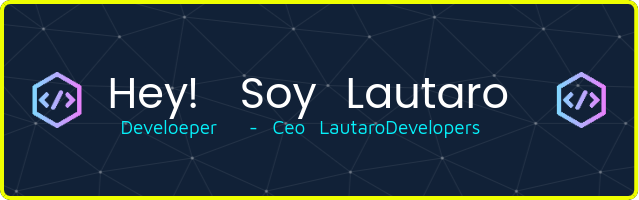

#  Bienvenid@ a mi perfil

 Soy un programador con una pasión insaciable por la tecnología y el desarrollo de software. Desde que comencé a programar, he estado en un constante viaje de aprendizaje, explorando distintos lenguajes y frameworks para transformar ideas en soluciones reales.

## Skils

##  GitHub Stats:

## 🏆 GitHub Trophies

